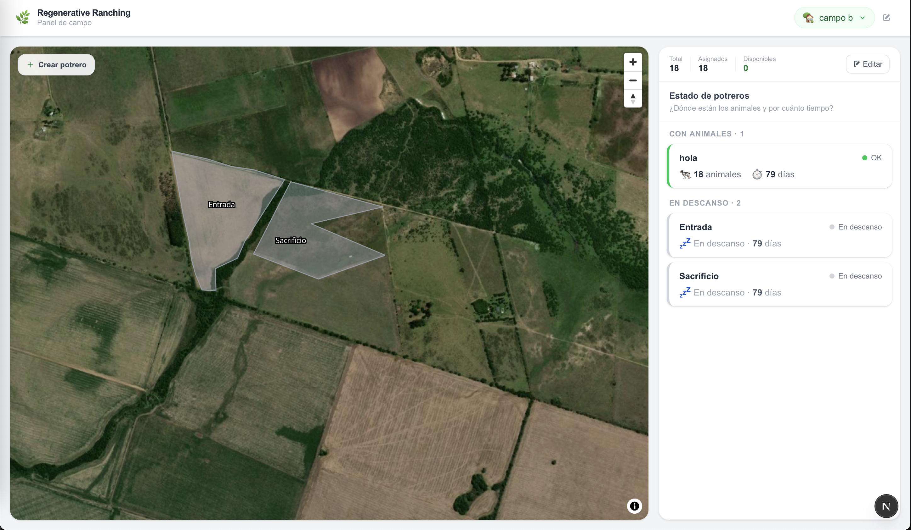
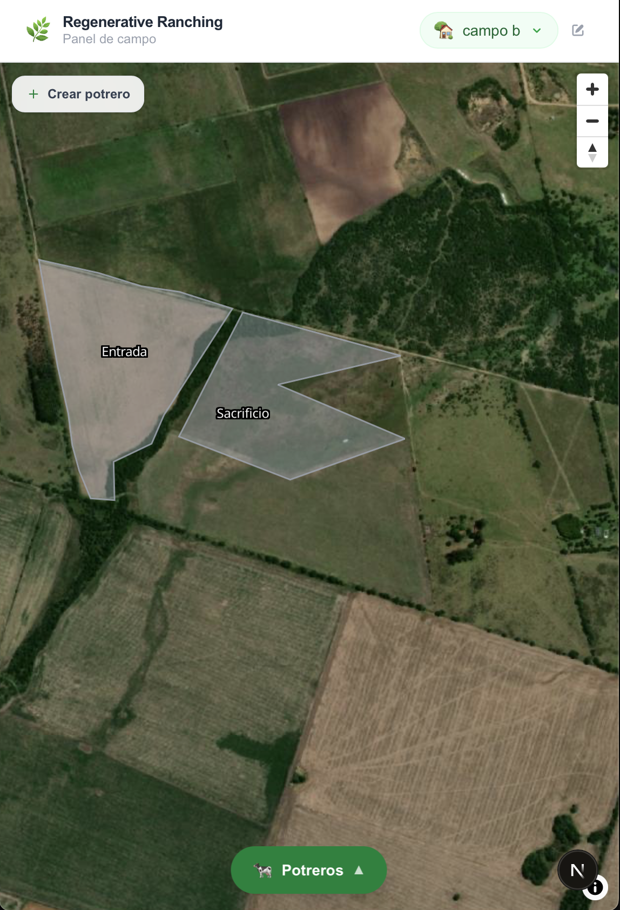
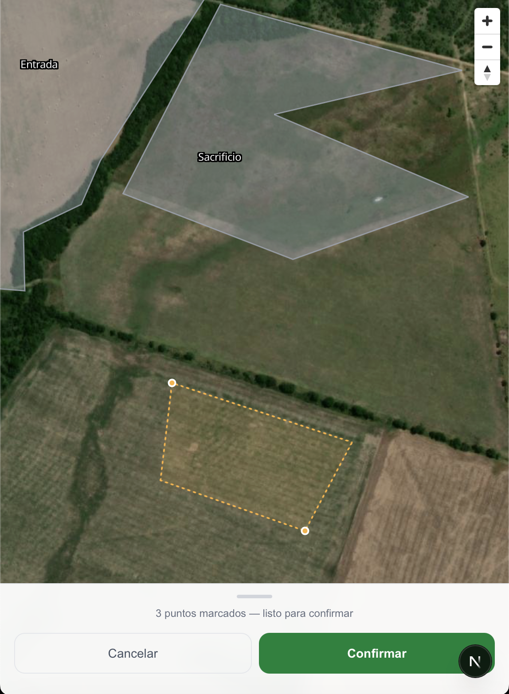
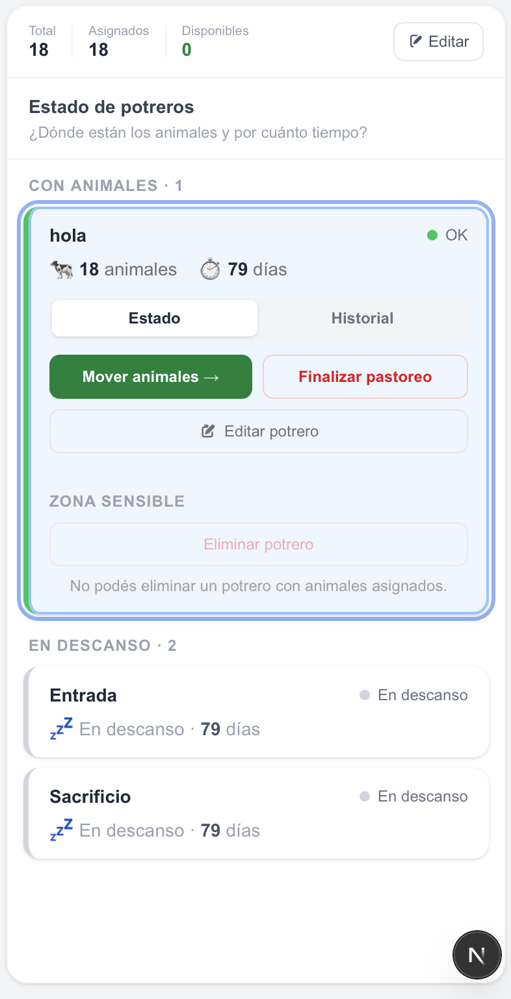
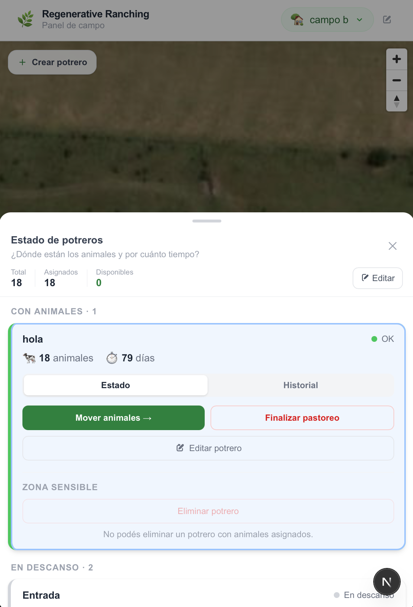
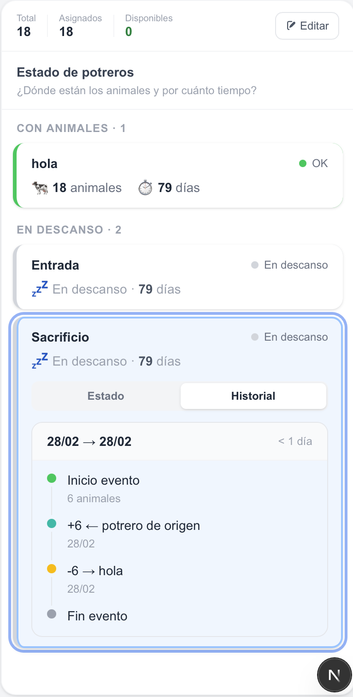
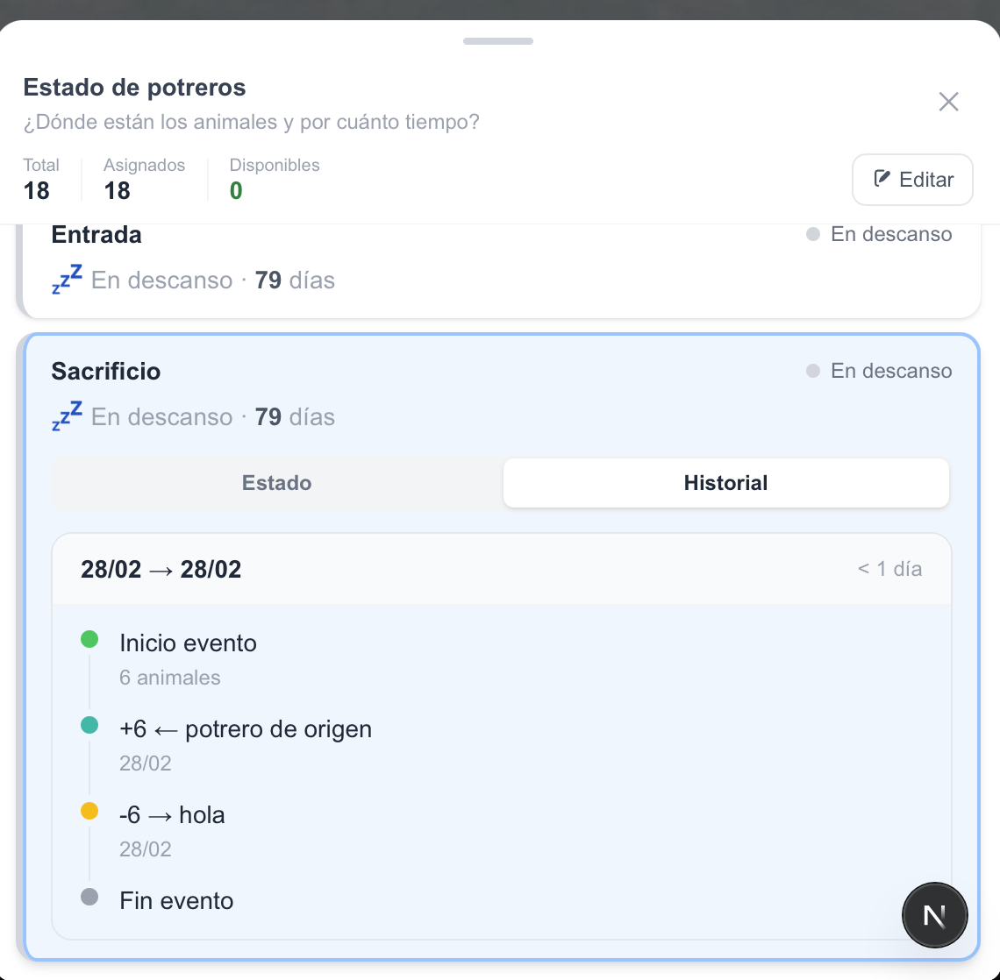

# Regenerative Ranching Manager

A visual operational management platform for regenerative grazing systems.

This project helps producers and field teams manage paddocks, animal stock, grazing events, and rest periods through a map-centered interface designed to support real operational decisions.

> Currently under active development and continuous evolution.

---

## Product Preview

  

---

## About the Project

Regenerative Ranching Manager was created to simplify the operational management of regenerative grazing systems by centralizing geographic organization, livestock movements, and grazing history into a single visual workflow.

Instead of relying on spreadsheets, static maps, or operational memory, the platform provides real-time visibility into:
- paddock occupation
- grazing and resting periods
- animal distribution
- stock availability
- historical grazing events

The goal is not only to digitize records, but to improve decision-making through spatial context, traceability, and actionable system status indicators.

---

## Core Features

- Multi-farm management
- Interactive paddock creation directly on satellite maps
- Livestock stock management
- Animal assignment and movement between paddocks
- Grazing event tracking
- Rest period monitoring
- Historical traceability of paddock activity
- Operational status indicators (OK, Warning, Alert)
- Visual map-based workflow focused on daily field operations

---

## Screenshots

### Map-Based Paddock Management

  

### Operational Workflow Panel

  

### Grazing History & Traceability

   

---

## Product Vision

This project is heavily product-oriented and focuses on translating a complex operational process into a simple and intuitive experience.

The platform combines:
- geospatial visualization
- operational workflows
- traceability
- livestock management
- real-time field context

Rather than forcing users to think in tables and spreadsheets, the application is designed around territory, rotation, grazing pressure, and real operational decisions.

---

## User Experience

The product experience revolves around two complementary views:
- the map, used to understand the field spatially
- the operational side panel, used to manage the daily workflow

This creates a much more natural interaction model for regenerative grazing management.

---

## Tech Stack

### Frontend
- Next.js
- TypeScript
- MapLibre GL

### Backend
- NestJS
- PostgreSQL
- Prisma ORM

---

## Project Status

This is an ongoing personal project currently focused on validating the product vision and core operational workflow.

The platform is actively evolving and new features, architecture improvements, and operational capabilities are continuously being explored.
